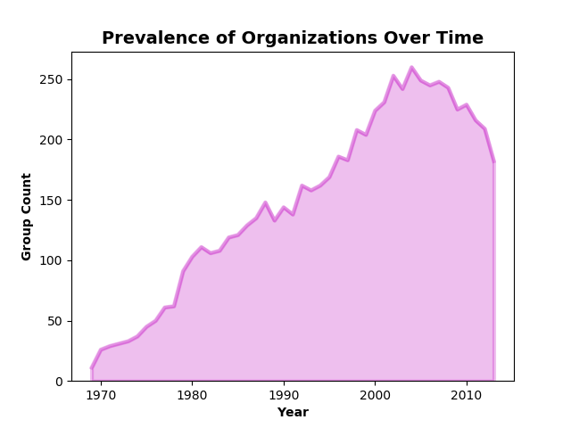
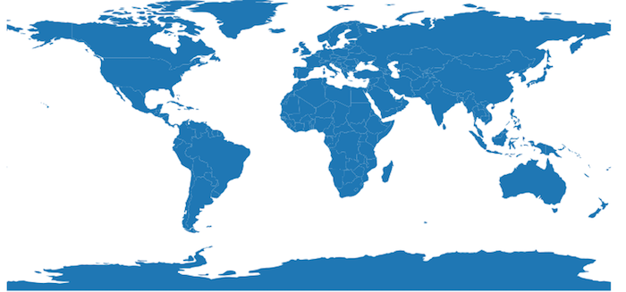
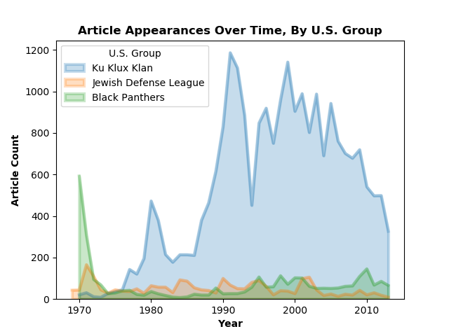
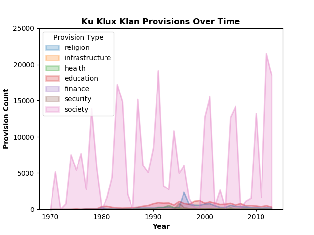
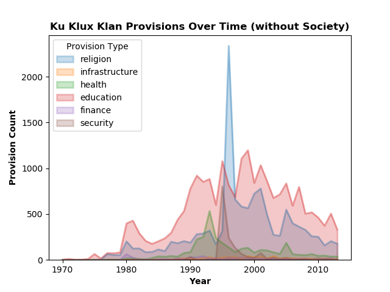
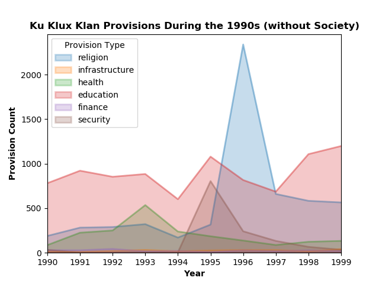

# **Exploring Data on 45 years of Service Provisions Among Non-state Actors**
# Jane Stout, Ph.D.

## Background
One Earth Future(OEF) is non-profit in Broomfield, CO, whose mission is to foster sustainable peace by building effective networks and resilient societies in fragile and post-conflict environments around the world. OEF has a research department aiming to produce actionable, empirical research that speaks to how a world without war can be achieved. One line of research at OEF focuses on the role of **terrorist and insurgent groups** (heretofore referred to as **“non-state actors"**) in times of conflict. In particular, OEF studies non-state actors’ use of social services during times of conflict. According to OEF researchers, non-violent activities of violent groups are correlated with many important outcomes and enahnce our understanding of the internal functions of terrorist organizations. For instance, some violent groups seek legitimacy and international support through service provision.

## Data Description
For this project, I used OEF’s Terrorist and Insurgent Organizations’ Service Provision across time (TIOS 2.0) dataset for this project. The TIOS 2.0 dataset provides indicators associated with whether and how more than 400 violent non-state actors provide public goods and services across more than four decades (1969–2013). The underlying motivating assumption is that service-providing groups will have, on average, more stories mentioning service provision compared with groups that provide fewer or no services. To the best of OEF’s knowledge, this represents the widest coverage across both time and groups for this type of data.

Data were collected from a predetermined list of approximately 400 non-state groups (detailed in Cronin, 2011). **Data were pulled from all English language print news coverage available on LexisNexis.** As of 2006, LexisNexis has the world's largest electronic database for legal and public-records related information. For each group in the sample, OEF searched within new stories for words and phrases that correlate with service provision (see Describing the Data for details).

#### **From the TIOS 2.0 codebook:**

_"**Each observation in the dataset is a group-year.** There are, broadly speaking, four sets of variables. The first are the raw counts of keywords. The values for these variables equal the number of times that keyword was mentioned in all of the .txt files for that group-year. The second set of variables are manipulations of the raw counts. These variables include the combinations of the raw counts into sectors as well as taking the mean of all within-sector variables. These give a broader sense of the types of services each group provides each year. The third set of variables provide a sense of coverage using two metrics. The first of these is the word count for each group-year. The second is the article count for each group-year. The last set of variables includes the identifiers for each observation and includes variables suited to merging these data with other commonly used conflict datasets (described in Capstone 2 Goals section)."_

## Goals
+ Explore the data, with an eye toward future potential research questions that will use inferential statistics/model testing. This will be accomplished via merging with other datasets (there are identifiers in the dataset).
+ Enhance my visualization skills.

## Describing the data
N = 6659

Exploration consisted of a few key factors:
+ **Time** (1969-2013)
+ **Groups** (e.g., Taliban, Ku Klux Klan)
  * Groups within the U.S.
+ **Base** (country in which group is based)
+ **Provisions** (types and counts):
  + Religion: church, mosque
  + Infrastructure: reconstruction, trash
  + Health: hospital, medic
  + Education: school, teacher
  + Finance: loan, microloan
  + Security: militia
  + Society: cultural, sport

## Data Visualization
I created an area graph of group prevalence over time. This graph represents a count of unique organization names in the dataset for each year (see Figure 1).

#### **Figure 1**

I also created an area graph of provisions rendered over time; this is a count of the total number of provisions documented in the dataset for each year (see Figure 2).

#### **Figure 2**

<!-- + A plot of these on the same graph reveals they their range is very different (prev max is 250, prov max is 2000000 [mil], see Provision_Type_over_time). Because social provisions were on much larger range than the rest of the provisions, I created a line graph of provisions by type over time, omitting social provisions. This graph represents a count of the number of specific provisions in the dataset for each year, omitting social provisions. (see Provision_Type_over_time_noSoc) -->
Next, I created a pie graph of the count of each type of provision in the dataset, collapsed across year. As seen in Figure 3, social provisions are by far the most popular provisions.

#### **Figure 3**

I also explored data on the country that is the base for each non-state actor with the goal of producing a heat-map. I used GeoPandas to create a heatmap of the number of times non-state actors provided services, across time.

To do this, one uses the GeoPandas built-in 'world' dataset, which contains country names, geometric shapes of those countries, and spatial location of those shapes on the world map. See Table 1 for the first five rows of the built-in dataset.

#### **Table 1**

| pop_est  | continent     | name                 | iso_a3 | gdp_md_est | geometry                                                     |
|----------|---------------|----------------------|--------|------------|--------------------------------------------------------------|
| 28400000 | Asia          | Afghanistan          | AFG    | 22270      | POLYGON ((61.21081709172574 35.65007233330923,...))          |
| 12799293 | Africa        | Angola               | AGO    | 110300     | MULTIPOLYGON (((16.32652835456705 -5.877470391466218,...)))  |
| 3639453  | Europe        | Albania              | ALB    | 21810      | POLYGON ((20.59024743010491 41.85540416113361,...))          |
| 4798491  | Asia          | United Arab Emirates | ARE    | 184300     | POLYGON ((51.57951867046327 24.24549713795111,...))          |
| 40913584 | South America | Argentina            | ARG    | 573900     | MULTIPOLYGON (((-65.50000000000003 -55.19999999999996,...))) |

Using this dataset, GeoPandas builds a template that can then apply to their own data (see Figure 4 for template).

#### **Figure 4**

To work with this template, one merges their own pandas dataframe into the built-in dataset, matching on a common variable. In my case, I matched on country name and merged a column of data containing the count of the total number of times non-state actors provided services (i.e., aggregated across year). See Figure 5 for the resulting heatmap, which is the prevalence of non-state actors' services over the past 45 years.

#### **Figure 5**

I noticed a lot of "heat" in the U.S., so I explored the prevalence of groups in the U.S. and their provision rate. Table 2 displays a count of U.S. non-state actors over time; here, n = 45 indicates a group has provided services for each year in the dataset (i.e., 45 years).

#### **Table 2**
<!--  -->

| Groups in the United States                     | N Years |
|-------------------------------------------------|---------|
| Jewish Defense League (JDL)                     | 45      |
| Ku Klux Klan (KKK)                              | 44      |
| Black Panthers                                  | 44      |
| Omega-7                                         | 37      |
| El Rukn                                         | 36      |
| Army of God                                     | 35      |
| Order II                                        | 33      |
| Aryan Nations (AN)                              | 31      |
| Armed Forces of National Liberation             | 24      |
| Hammerskin Nation                               | 21      |
| al-Fuqra                                        | 21      |
| Covenant Sword and Arm of the Lord (CSA)        | 20      |
| Islamic Salvation Front                         | 14      |
| Croatian Freedom Fighters (CFF)                 | 13      |
| Nation of Yahweh                                | 13      |
| Cambodian Freedom Fighters (CFF)                | 13      |
| Yemen Islamic Jihad                             | 10      |
| Justice Commandos for the Armenian Genocide     | 9       |
| Armenian Revolutionary Army                     | 9       |
| Hector Riobe Brigade                            | 2       |
| Black Revolutionary Assault Team                | 1       |
| Independent Armed Revolutionary Movement (MIRA) | 1       |    

I explored the top three U.S. groups (by occurance rate over time):
* KKK
* Jewish Defense League
* Black Panthers

Figure 6 shows a count of the number of articles in which groups were mentioned over time.

#### **Figure 6**

Given that the KKK is the most prevalent group in the U.S., I explored their provision rate by type, and over time. I saw social provisions were by far the most prevalent for each group (see Figure 7).

#### **Figure 7**

So, I re-plotted the figure, omitting social provisions (see Figure 8).

#### **Figure 8**

I noticed a spike in religious provisions for the KKK in the 90s, so I zoomed in on that (see Figure 9).

#### **Figure 9**

What's going on around 1996?
+ 1996: Election year
+ 1995: O.J. Simpson trial
+ 1995: Million Man March; conceived by Nation of Islam leader Louis Farrakhan

## Future Directions
These data are interesting, but they would be even more compelling if I could use them to make predictive models. To that end, I plan to merge these data with another dataset(s) so that provision prevalence and type could be treated as predictors. This type of analysis could address questions like: _Do provisions increase group membership? Do provisions increase public favor/perceptions of legitimacy? If so, which provisions are most influential?_

Another interesting element of this project focuses on domestic forms of terrorism. To continue this line of inquiry, I plan to work with the Global Terrorism Database (GTD), which is an open-source database including information on terrorist events around the world from 1970 through 2017. The GTD has the following characteristics:
+ Contains information on over 180,000 terrorist attacks, from 1970-2017
+ More than 4,000,000 news articles and 25,000 news sources were reviewed to collect incident data from 1998 to 2017 alone
+ Includes information on at least 45 variables for each case, with more recent incidents including information on more than 120 variables
  + Target Type, Perpetrator, Attack Type, Weapon Type

#### References
Cronin, A. K. (2011) How Terrorism Ends: Understanding the Decline and Demise of Terrorist Campaigns. Princeton, NJ: Princeton University Press.
